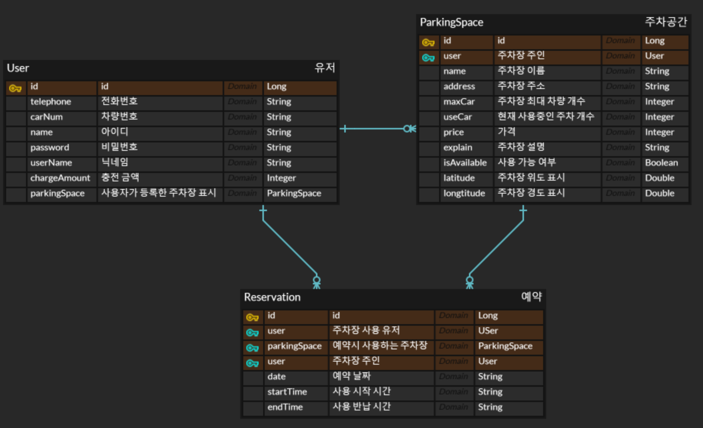

# 카피바라 - 차곡차고
## 서비스 요약
### 차곡차고
- '차곡차고'는 차량을 사용하는 다양한 배경의 학우들을 위한 학교 주변의 남는 주차 공간을 이용할 수 있는 서비스입니다.

## 주제 구분
- E타입 경북대에 다니는 다양한 배경의 학우들을 위한 서비스

## 팀원 소개
카피바라 팀원 소개

### Front-End

| 권대호 | 남지연 |
| --- | --- |
| [@neverx3gu](https://github.com/neverx3gu) | [@nJiyeon](https://github.com/nJiyeon) |
- 권대호 - 컴퓨터학부 22학번, 프론트엔드 및 디자인 담당
- 남지연 - 컴퓨터학부 21학번, 프론트엔드 및 디자인 담당
### Back-End

| 장보형 | 정세엽 |
| --- | --- |
| [@jbh010204](https://github.com/jbh010204) | [@clcok](https://github.com/clcok) |
- 장보형 - 컴퓨터학부 21학번, 백엔드 및 배포 담당
- 정세엽 - 컴퓨터학부 21학번, 백엔드 및 배포 담당

## 시연 영상
(필수) Youtube 링크
(선택) Github Repository 페이지에서 바로 볼 수 있도록 넣어주셔도 좋습니다.

## 서비스 소개
### 서비스 개요
- 경북대학교 학생들 중 주차 공간이 마땅치 않은 사용자에게 주변 자취방 및 공터의 잉여 주차 공간을 저렴하게 사용할 수 있도록 도와주는 서비스입니다.
- 사용자는 서비스를 통해 주차 공간을 예약하여 빠르고 편리하게 주차 공간을 사용할 수 있습니다.
- 또한, 사용자가 건물을 소유중이라면 주차 공간을 등록하여 다른 사용자에게 주차 공간을 제공하여 수익을 남길 수 있습니다.

### 타서비스와의 차별점
1. 타서비스와는 달리 대학교라는 특징을 통해 주변 원룸의 잉여 주차 공간을 효율적으로 활용할 수 있습종 결과물입니다. 심사시 참고 부탁드립니다.
1. 주차장 등록 서비스
  - 사용자는 주차장을 등록하여 다른 사용자에게 주차장을 제공할 수 있습니다.
  - 등록자는 주차장 제공을 통해 잉여 주차 공간에서 수익을 남길 수 있습니다.
 
2. 주차장 이용 서비스
- 핵심기능 소개
  - 주차장 등록 서비스
    - 사용자는 주차장을 등록하여 다른 사용자에게 주차장을 제공할 수 있습니다.
    - 등록자는 주차장 제공을 통해 잉여 주차 공간에서 수익을 남길 수 있습니다.
  - 주차장 이용 서비스
    - 사용자는 지정 주차장이 아닌, 주변 건물에서 주차 장소를 유연하게 확보할 수 있습니다.
    - 사용자는 주차장을 예약하여 주차장을 사용할 수 있습니다.

### 구현 방식
- 디자인으로는 Figma 사용하였습니다.
- 프론트엔드로는 Kotlin과 개발환경으로는 AndroidStudio를 사용하였습니다.
- 백엔드로는 Java와 Spring 개발환경으로는 IntelliJ, 데이터베이스로는 h2-database를 사용하였습니다.
#### [ERD]

- 위 그림은 ERD 설계구조입니다.
- User엔티티는 Reservation 및 ParkingSpace엔티티와 1:N관계를 이루며, ParkingSpace와 Reservation엔티티 또한 1:N관계를 이룹니다.
#### [API](https://www.notion.so/108d0213799280f288e4ccb764e6e34c?v=5a5bdac715104e07af99510fdb6b40e7)
- 위 API 클릭시 API 명세 화면으로 이동하실 수 있습니다.
#### [아키텍쳐 구조]

- 위 그림은 아키텍쳐 구조를 설명하는 그림입니다.
- 서버는 로컬호스트에서 스프링부트를 이용해 DB(h2-database)와 통신하고 ngrok를 이용해 외부 접속을 가능하게 합니다..
- 앱은 유저와 상호작용하는 정보들을 ngrok를 통해 받은 url로 DB와 소통합니다.

## 향후 개선 혹은 발전 방안
1. 주차장 등록시 등록하는 사용자가 해당 건물 소유자인지 확인하는 과정이 없습니다.
  이에 따라 추후 신분증, 사업자등록증, 건축물 대장 인증을 통해 등록자가 소유자인지 확인하는 발전 방안을 염두에 두고 있습니다.
2. 개발 상황으로는 충전 금액을 통해 사용자간 결제를 하도록 되어있지만, 추후 발전으로 카카오페이 송금 또는 TOSS 송금을 통해 더욱 편리하게 발전할 수 있습니다.
3. 하나의 어플리케이션에서 공통된 사용자가 등록 및 조회를 할 수 있는 기능이 구현되어 있지만 제공자와 사용자의 관계이므로 사용자가 늘어나는 경우를 대비하여 두 가지 기능을 각각 분리하여 서로 다른 어플리케이션을 생성하고 트레픽 관리를 통해 사용자의 편의성을 더욱 증가 시킬 수 있습니다.
